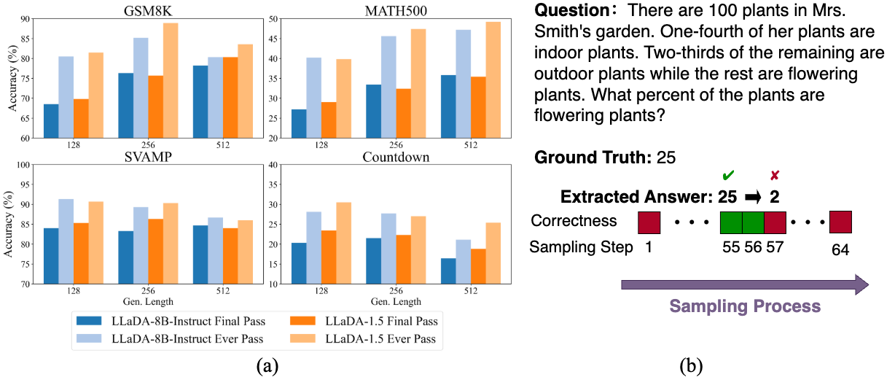

#  Time Is a Feature: Exploiting Temporal Dynamics in Diffusion Language Models

[](#)
[](https://aim-uofa.github.io/dLLM-MidTruth/)
[](#)
[](https://opensource.org/license/bsd-2-clause)

## 📣 News

## 🚀 Motivation

Diffusion large language models (dLLM) have recently emerged as a promising alternative to the auto-regressive (AR) large language models. However. current dLLMs typically adopt a decoding strategy that mirrors AR models: solely relying on the sequence predicted in the final denoising step as the final answer, and discarding all the intermediate predictions. This greedy decoding strategy ignores rich temporal dynamics that dLLMs possess in sampling process. 

In our analysis of two metrics for widely used mathematical benchmark datasets,  a consistent and significant discrepancy emerges between two key metrics. the first metric, final pass rate, measures the accuracy of the final output, while the second, ever-pass rate, captures how often a correct answer appears at any intermediate decoding step. This discrepancy highlights that correct predictions made during early iterations are frequently overwritten of lost in later stages. 

This insight motivates our two complementary methods that leverage temporal dynamics:

- **Temporal Majority Voting**: a test-time decoding strategy that aggregates predictions across sampling steps.
- **Temporal Consistency Reinforcement**: a post-training approach designed to encourage stable and consistent generations.

<div align="center">

</div>

<!-- ## Getting Started

```
todo: file structure
```

### Setup

### Temporal Majority Voting

### Temporal Consistency Reinforcement

### Evaluation -->

## 🚩 Plan
- [ ] paper release 
- [ ] source code of temporal majority voting and evaluation
- [ ] source code of temporal consistency reinforcement

## 🎫 License

For academic use, this project is licensed under [the 2-clause BSD License](https://opensource.org/license/bsd-2-clause). 
For commercial use, please contact [Chunhua Shen](mailto:chhshen@gmail.com).

## 🖊️ Citation

If you find this work useful, please consider citing:

```bibtex 
todo
```