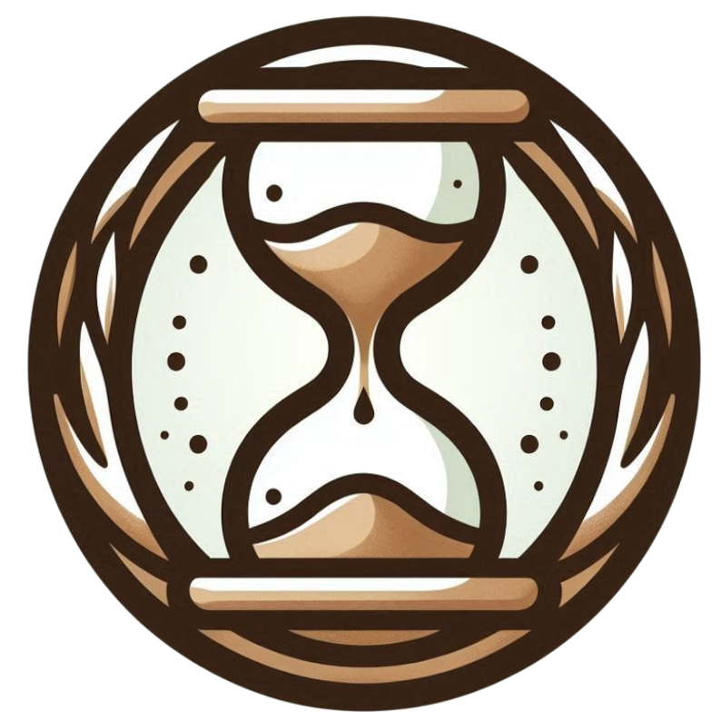

#  Time Is a Feature: Exploiting Temporal Dynamics in Diffusion Language Models

[](https://arxiv.org/abs/2508.09138)
[](https://aim-uofa.github.io/dLLM-MidTruth/)
[](#)
[](https://opensource.org/license/bsd-2-clause)

## 📣 News

- [2025-08-21] Code of Temporal Self-Consistency Voting and Evaluation Released!
- [2025-08-13] Paper Released!


## 🚀 Overview

<div align="center" >

</div>

## 📖 Description

Diffusion large language models (dLLMs) generate text through iterative denoising, yet current decoding strategies discard rich intermediate predictions in favor of the final output. Our work here reveals a critical phenomenon, <b>temporal oscillation</b>, where correct answers often emerge in the middle process, but are overwritten in later denoising steps.
To address this issue, we introduce two complementary methods that exploit temporal consistency: 
- **Temporal Self-Consistency Voting**, a training-free, test-time decoding strategy that aggregates predictions across denoising steps to select the most consistent output; 
- **Temporal Consistency Reinforcement**, a post-training method that uses Temporal Semantic Entropy (TSE), a measure of semantic stability across intermediate predictions, as a reward signal to encourage stable generations. 


## ⚙️ Getting Started

### Environment Setup

To setup the environment, run;
```
conda env create -f env.yml
conda activate tiaf
```

### Temporal Majority Voting

We provide a simple plug-and-play generate script to perform temporal self-consistency voting in `eval/generate.py`.

You can enable the voting mechanism by passing the `--enable_vote` flag together with both `--tokenizer` and `--parse_answer_func`.
Optionally, you may also specify `--vote_method` (fixed, linear, or exp) and, if using the exp method, control the weighting strength with `--alpha`.


<!-- ### Temporal Consistency Reinforcement -->

### Evaluation

You can easily evaluate our method by running the following command (using GSM8K with a generation length of 128 as an example):

```bash
cd eval

CUDA_VISIBLE_DEVICES=0,1,2,3 torchrun \
    --nproc_per_node 4 \
    --master_port 29173 \
    eval.py \
    --dataset gsm8k \
    --batch_size 8 \
    --gen_length 128 \
    --diffusion_steps 64 \
    --output_dir "outputs/LLaDA-8B-Instruct/gsm8k_gen_128_steps_64_temp_0_vote" \
    --model_path <your_model_path> \
    --enable_vote \
    --vote_method exp \
    --alpha 5.0 
```

For convenience, we also provide a wrapper script `eval/run_eval.sh` that allows easier evaluation management.
You can modify the parameters in this script to test different datasets, and voting strategies.

To compute accuracy, run `get_acc.py` after the evaluation is done.

## 🚩 Plan
- [x] source code of temporal self-consistency voting and evaluation
- [ ] source code of temporal consistency reinforcement
- [ ] checkpoints of temporal consistency reinforcement

## 🎫 License

For academic use, this project is licensed under [the 2-clause BSD License](https://opensource.org/license/bsd-2-clause). 
For commercial use, please contact [Chunhua Shen](mailto:chhshen@gmail.com).

## 🖊️ Citation

If you find this work useful, please consider citing:

```bibtex 
@article{wang2025temporaldynamics,
    title={Time Is a Feature: Exploiting Temporal Dynamics in Diffusion Language Models},
    author={Wen, Wang and Bozhen, Fang and Chenchen, Jing and Yongliang, Shen and Yangyi, Shen and Qiuyu, Wang and Hao, Ouyang and Hao, Chen and Chunhua, Shen},
    journal={arXiv preprint arXiv:2508.09138},
    year={2025}
}
```